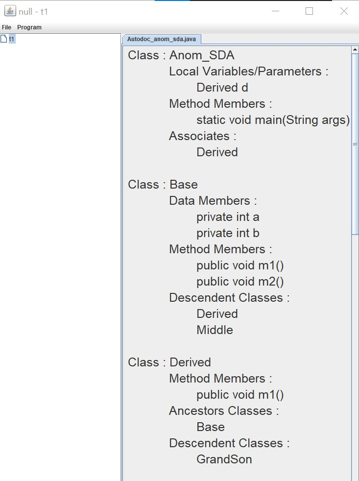
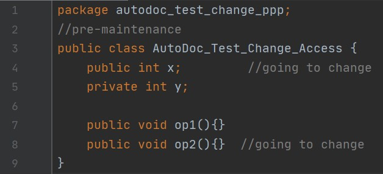
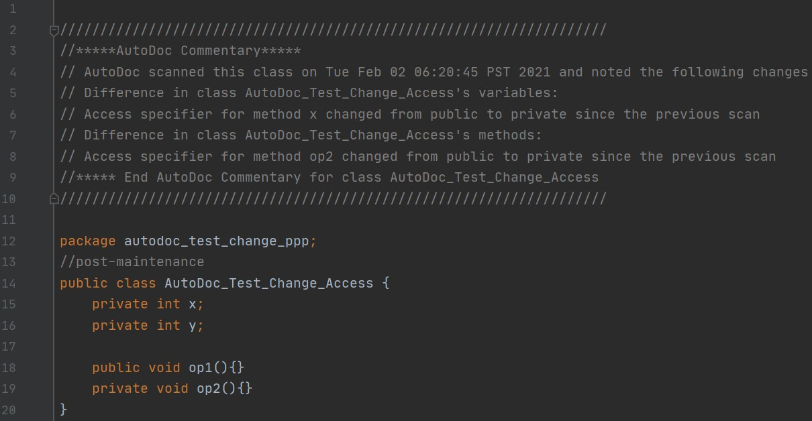

  <h3 align="center">AutoDoc - Object Oriented Program Information Extraction</h3>

<!-- TABLE OF CONTENTS -->
<details open="open">
  <summary>Table of Contents</summary>
  <ol>
    <li>
      <a href="#about-the-project">About The Project</a>
      <ul>
        <li><a href="#built-with">Built With</a></li>
      </ul>
    </li>
    <li>
      <a href="#getting-started">Getting Started</a>
      <ul>
        <li><a href="#prerequisites">Prerequisites</a></li>
        <li><a href="#local-setup-and-usage">Local Setup and Usage</a></li>
      </ul>
    </li>
    <li><a href="#examples">Examples</a></li>
  </ol>
</details>


## About The Project

AutoDoc is a tool which can be used to compare two different versions of a Java program (Pre-maintenance and Post-maintenance) and get the report describing the changes that were made. 
It can be also used to extract the information of a Java source code file and get info about it's various components such as Classes, Methods, Variable, Ancestors, Descendents and more. 

### Built With

The project is built with 
* [Java](https://www.java.com/en/)
* [ANTLR](https://www.antlr.org/)

## Getting Started

To get a local copy up and running follow these simple steps.

### Prerequisites
You must have Java and ANTLR set up on your machine to run the application.

### Local Setup and Usage

1. Clone the repo
   ```sh
   git clone https://github.com/mandar242/AutoDoc-OOP-Information-Extraction.git
   ```
2. Run the program in either in NetBeans or IDE of your choice.
3. In GUI click File -> New Project -> Enter Project Name -> Ok
4. Click Program -> Select Program (select the java source file from the explorer) -> Get Program Info
	When you do step 4, you will get the program information displayed in GUI.
5. To get the comparison report of the pre and post maintenance version -> perform step 4 again and in your post maintenance source file you will have the report added as a comment. 

## Examples

* Getting information of a Java source file.

	
* Getting the comparison report of two different versions of a program source file.

	
	
